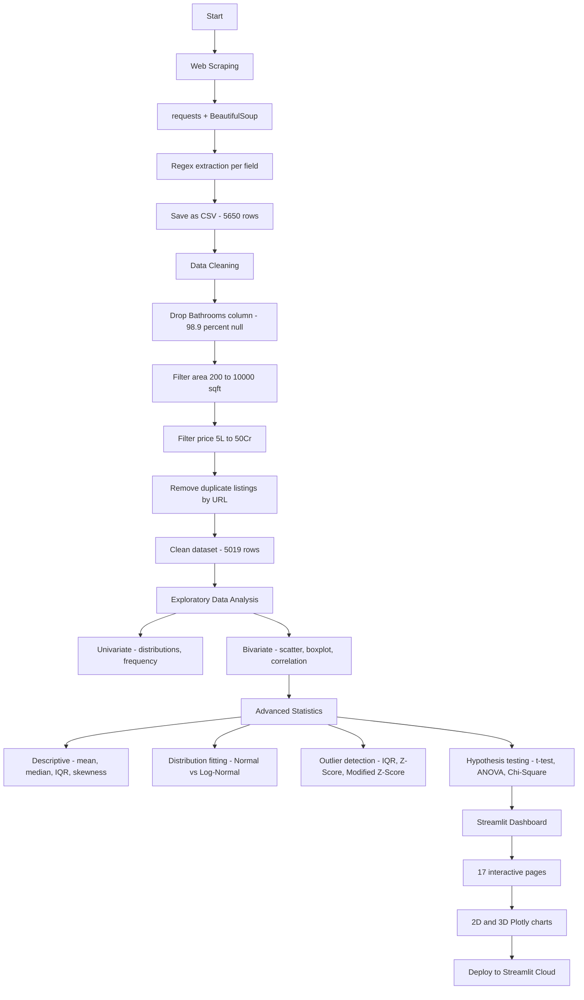

# Magicbricks Real Estate Analytics

An end-to-end data science project that scrapes real estate listings from Magicbricks,
performs exploratory data analysis, and applies advanced statistical methods —
all presented through an interactive Streamlit dashboard.

---

## Project Overview

This project covers the full data science pipeline: collecting raw data from the web,
cleaning it, exploring patterns through visualisation, and applying statistical tests
to draw conclusions. The final output is a multi-page Streamlit application with
2D and 3D interactive charts.

**Dataset:** 5,650 property listings across 6 Indian cities  
**Cities:** Hyderabad, Pune, Chennai, Mumbai, Gurgaon, Noida  
**Target variable:** Property price in Indian Rupees

---

## Workflow



---

## Repository Structure

```
magicbricks-analytics/
├── app.py                       # Main Streamlit application (17 pages)
├── magicbricks_properties.xls   # Dataset (CSV format despite .xls extension)
└── requirements.txt             # Python dependencies
```

---

## Dashboard Pages

| Section | Page |
|---|---|
| Home | Overview with KPIs and 3D property explorer |
| Data and Scraping | Web scraping walkthrough, Dataset explorer |
| Exploratory Analysis | Univariate analysis, Bivariate analysis |
| Advanced Statistics | Basic statistics, Five-number summary, Distributions |
| Advanced Statistics | Boxplots, Categorical analysis, Missing values |
| Advanced Statistics | Correlation, Skewness and kurtosis, Outlier detection |
| Advanced Statistics | Distribution fitting, Hypothesis testing, Key takeaways |

---

## Key Findings

- Median price (Rs 1.6 Cr) is a far more honest measure than mean (Rs 3.76 Cr) due to extreme right skew
- Area correlates very weakly with price (r = 0.03); city is the dominant price driver
- Mumbai median price is approximately 3x that of Chennai — confirmed by ANOVA (p < 0.05)
- Property prices follow a Log-Normal distribution, not Normal
- Roughly 8.6% of listings are outliers by IQR method (above Rs 6.75 Cr)
- Furnishing type and property status are statistically related (Chi-Square p < 0.05)

---

## Tech Stack

| Purpose | Library |
|---|---|
| Web scraping | requests, BeautifulSoup, re |
| Data manipulation | pandas, numpy |
| Statistics | scipy |
| Visualisation | plotly |
| Dashboard | streamlit |

---

## Local Setup

**Requirements:** Python 3.8+, pip or conda

```bash
# Clone the repository
git clone https://github.com/viswanath-0/magicbricks-analytics.git
cd magicbricks-analytics

# Create and activate virtual environment
python -m venv venv
venv\Scripts\activate          # Windows
source venv/bin/activate       # macOS / Linux

# Install dependencies
pip install -r requirements.txt

# Run the app
streamlit run app.py
```

The app will open at `http://localhost:8501`

> The data file `magicbricks_properties.xls` must be in the same directory as `app.py`.
> It is a comma-separated CSV file. Read it with `pd.read_csv()`, not `pd.read_excel()`.

---

## Deployment

This project is deployed on Streamlit Cloud.

1. Push all three files (`app.py`, `requirements.txt`, `magicbricks_properties.xls`) to a GitHub repository
2. Go to [share.streamlit.io](https://share.streamlit.io) and connect the repository
3. Set the main file path to `app.py`
4. Click Deploy

---

## Statistical Methods Covered

- Measures of central tendency and spread (mean, median, mode, variance, standard deviation, CV)
- Five-number summary and IQR
- Percentiles and quartile analysis
- Skewness and kurtosis
- Pearson correlation
- Outlier detection: IQR fence, Z-Score, Modified Z-Score
- Distribution fitting: Shapiro-Wilk test, Kolmogorov-Smirnov test
- Hypothesis testing: independent t-test, one-way ANOVA, Chi-Square test

---

## Author

GitHub: [viswanath-0](https://github.com/viswanath-0)
